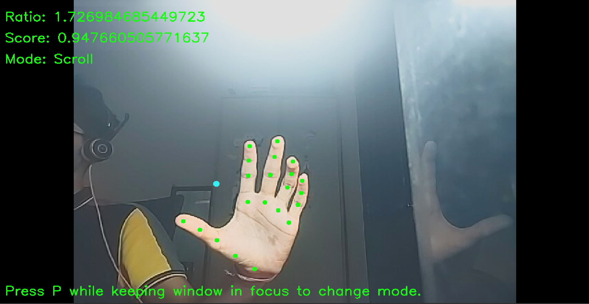

# Lazy Control

**Lazy Control allows you to easily control your pc with hand guestures. It provides with Scrolling, Mouse and Zoom functionality**

  

# Guesture Modes
## Scroll
To scroll, you must bring your thumb and index fingers in contact and then move your hand up and down.
## Mouse
In mouse mode the mouse cursor moves with the **Mid point of your thumb and index figer**. You tap the index finger and thumb to click and you hold the thumb and middle finger to stop movement if you may want to adjust your hand.
## Zoom
In zoom mode, you must keep the thumb and index finger in contact and then zoom by moving the middle finger closer or far away from your thumb.

# Configuration
You can edit the following variables at the top of the code -
 - scroll_sensitivity => sensitivity for scrolling
 - sensitivity => sensitivity for mouse movement
 - scroll_small_movement => min threshold for scrolling 
 - small_movement => min threshold for moving mouse
 - ti_tap_threshold => threshold to consider thumb and index finger in contact
 - tm_tap_threshold => threshold to consider thumb and middle finger in contact

**Also you can press "P" to switch between the modes while having the window in focus.**